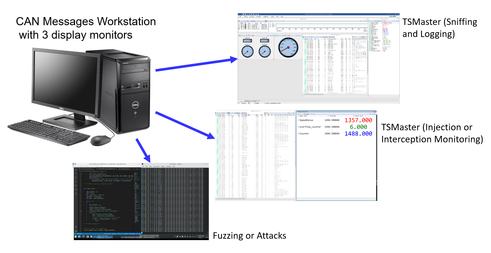
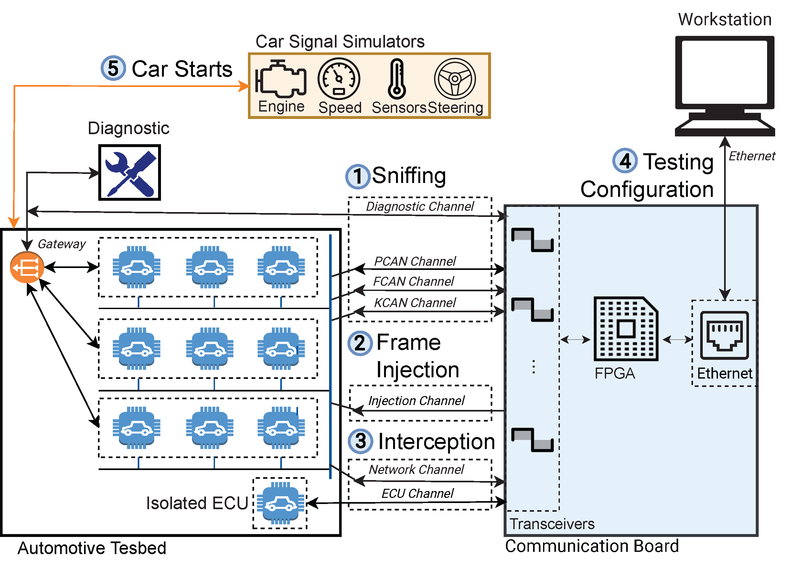

  

# VitroBench Test Platform

VitroBench is a comprehensive test platform that manipulates in-vehicle networks and COTS ECUs on your bench. Our <a href="https://www.sciencedirect.com/science/article/pii/S2214209623000797">VitroBench paper</a> is published on Vehicular Communications, Volume 43 (October 2023). This repository keeps the software that is used in this project.

  

  The software for sniffing, injection or interception, and fuzzing or attacks is executed on the CAN Messages (CM) workstation. Three displays monitor the respective messages:

1. TSMaster (Sniffing and Logging)  
2. TSMaster (Injection or Interception Monitoring)  
3. Fuzzing or Attacks

## Testing Setup

 The testing setup depends on the operation of the test platform. Operation videos can be obtained from the following website, <a href="https://www.vitrobench .com">VitroBench</a>. 

| Operation | Description |
| :-------- | :---------- |
| Sniffing  | All the IVNs messages are monitored and captured via TSMaster. |
| Injection | A channel can be used to transmit messages to the targeted network with configurable frame interval. |
| Interception | An ECU can be isolated via bridging and its intercepted messages will pass through the workstation. |
| Fuzzing & Attacks | A fuzzing program can be executed at the workstation on the injected or intercepted messages. Different programs for attacks can be explored by modifying the intercepted or injected messages. |

  

There are three possible testing scenarios as illustrated in the figure. For normal operation, the four channels of PCAN, FCAN, KCAN and Diagnostic are set up for (1) Sniffing. For (2) Frame Injection, an additional injection channel is connected to the network. For bridging, a targeted ECU is separated and re-connected to the ECU channel and back via the network channel as shown in (3) Interception.

## Workstation Software
​Note: Sniffing software is from [TSMaster](https://github.com/TOSUN-Shanghai/TSMaster).

| Python Program | Description |
|:---------------|:------------|
| [bmw_bridge_passthru.py](https://github.com/yeoant/VitroBench/blob/main/bmw_bridge_passthru.py) | This program performs a pass-through of all messages via the bridge. |
| [bmw_cas130_attack.py](https://github.com/yeoant/VitroBench/blob/main/bmw_cas130_attack.py) | This attack forces the car to stop. CAS is isolated and bridged from KCAN. Within the  program, setting (attack_type=1) stops the car when the driver starts the car for the third time and setting (attack_type=2) stops the car when the  car is running, and a specified time duration is reached. |
| [bmw_ekp_attackBridge.py](https://github.com/yeoant/VitroBench/blob/main/bmw_ekp_attackBridge.py) | This is an  attack on the fuel pump controller by bridging Engine ECU from PCAN. Byte  7 (D8) of message 0xAA was fuzzed when the Engine RPM is greater than  750. During the attack, EKP outputs an erratic fuel pump signal. |
| [bmw_ekp_attackInject_Burst.py](https://github.com/yeoant/VitroBench/blob/main/bmw_ekp_attackInject_Burst.py) | This is  an attack on the fuel pump controller by injecting messages 0xAA to PCAN.  Byte 7 (D8) of message 0xAA was fuzzed when the Engine RPM is greater than 850. During the attack, EKP outputs an erratic fuel pump signal. |
| [bmw_flooding_inject_deltatime.py](https://github.com/yeoant/VitroBench/blob/main/bmw_flooding_inject_deltatime.py) | This  is a flooding attack by injecting message 0x80 to KCAN to cause a denial of service to the instrument cluster. The attack stopped the display message 0x1A6 to reach the Instrument Cluster. |
| [bmw_flooding_inject_deltatime_stealth.py](https://github.com/yeoant/VitroBench/blob/main/bmw_flooding_inject_deltatime_stealth.py) | This is a flooding attack by injecting stealth messages from 0x0 to 0x1A5 to KCAN to cause a denial of service to the instrument cluster. The attack stopped the display message 0x1A6 to reach the Instrument Cluster. |
| [bmw_jbe_fuzz1_v10.py](https://github.com/yeoant/VitroBench/blob/main/bmw_jbe_fuzz1_v10.py) | This program  conducts a penetration test by injecting random message IDs and data from the external Diagnostic network. The workstation can monitor all the In-Vehicle Networks (IVNs) messages to check which messages have      infiltrated the IVNs. Within the program, setting (sniff=True) will log the infiltrated messages to the file,      {'jbe_infiltrate'+date_time+'.blf'}. |
| [bmw_speed_attack1.py](https://github.com/yeoant/VitroBench/blob/main/bmw_speed_attack1.py) | This attack causes the instrument cluster to display the wrong speed. DSC is isolated and bridged from PCAN. The car runs normally until the attack speed of 40km/h. Thereafter, the speed in message 0x1A6 is randomly set. |
| [bmw_speed_attack2.py](https://github.com/yeoant/VitroBench/blob/main/bmw_speed_attack2.py) | This causes the instrument cluster to display the wrong speed. DSC is isolated and bridged from PCAN. The car runs normally until the attack speed of 10 km/h. Thereafter, the speed message 0x1A6 is incremented by 2/3 of the actual increased speed and clipped at the maximum speed of 35 km/h. |
